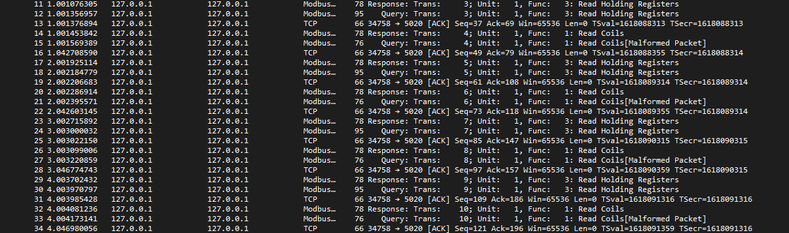
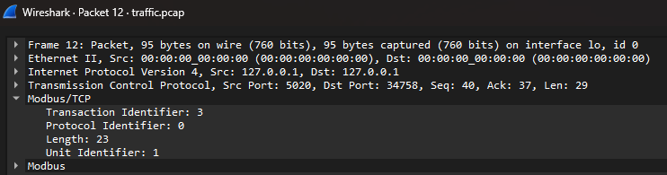
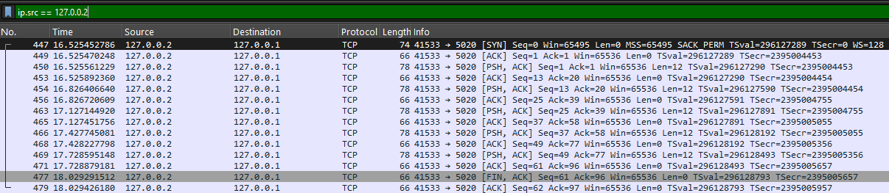
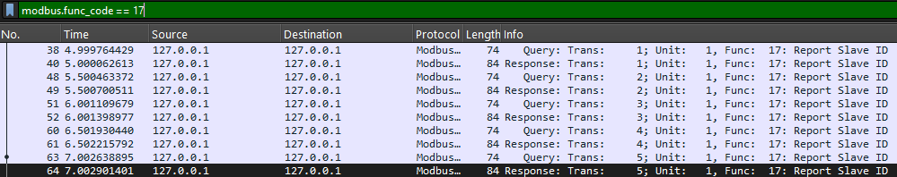

# ModbusWatch


Network-layer detection lab for Modbus TCP. It catches OT attacks that leave no trace in the sensor data, using Zeek.

## The idea

Industrial equipment (pumps, valves, tanks) is run by PLCs. A control room reads and writes the PLC's memory over Modbus TCP, a 1970s protocol with no authentication. Most ICS anomaly detection watches the process data: sensor values and physical limits. That approach is blind to a whole class of attacks that never change a sensor reading, such as reconnaissance, unauthorized clients, and malicious commands caught before they take effect.

ModbusWatch watches the network instead. It simulates a PLC and a control room, injects four attacks that produce no process-data signature, captures the traffic, and detects each attack with protocol-aware Zeek rules. Every attack maps to a MITRE ATT&CK for ICS technique.

## Results

Detected 4 of 4 injected attack classes with 0 false positives, graded automatically by comparing Zeek's alerts against a ground-truth log of what was actually launched.

| Attack class | MITRE ICS | Detected | Zeek alerts |
|---|---|---|---|
| Unauthorized function code | T0855 | yes | 5 |
| Register enumeration (recon) | T0846 | yes | 1 |
| Write to protected register | T0836 | yes | 1 |
| Unauthorized client | T0886 | yes | 5 |

The grader is `src/evaluate.py`. It reads `ground_truth.csv` and Zeek's `notice.log`, matches alerts to injected attacks by type and time, and counts anything left over as a false positive.

## The four attacks

Each one breaks a different rule of normal Modbus traffic, and three of the four cause no physical change at all, which is why process-based detection misses them.

1. **Unauthorized function code** (T0855). Normal traffic uses only read commands. The attacker sends function code 17, Report Server ID, a command the process never issues.
2. **Register enumeration** (T0846). The attacker sweeps the register map to fingerprint the PLC. Pure recon, no effect on the process, invisible to value-based detection.
3. **Write to a protected register** (T0836). A write to a setpoint register (100 to 120), caught at command time, before any physical change happens.
4. **Unauthorized client** (T0886). A Modbus request from a source IP outside the known-good set, which usually means an intruder has reached the OT network.

## How it works

```
normal_traffic.py + injector attacks  ->  traffic.pcap (tshark)
        |                                        |
   ground_truth.csv                              v
   (answer key)                    Zeek + zeek/modbus_detect.zeek
        |                                        |
        |                                    notice.log
        +----------->  src/evaluate.py  <--------+
                              |
                        results/results.md
```

## Screenshots

Normal Modbus polling (the healthy baseline):



A single Modbus request, decoded:



The unauthorized client (127.0.0.2) and the recon command (function code 17):




## Running it

Requires Python 3.10+, Zeek, and tshark on Linux.

```bash
# setup
python3 -m venv venv && source venv/bin/activate
pip install pymodbus==3.7.0

# terminal 1: start the simulated PLC
python3 src/server.py

# terminal 2: capture traffic, then run normal traffic + the four attacks
tshark -i lo -f "tcp port 5020" -w traffic.pcap &
python3 src/orchestrator.py

# detect and grade
zeek -C -r traffic.pcap zeek/modbus_detect.zeek
python3 src/evaluate.py
```

## Repo layout

```
src/        simulated PLC, normal traffic, four attacks, orchestrator, grader
zeek/       modbus_detect.zeek: the four detection rules
docs/       screenshots
results/    generated scorecard
```

## Limitations

This is a simulated lab on loopback, not real OT hardware or live plant traffic. Detection thresholds (for example the enumeration count) are tuned for this environment. It runs on port 5020 rather than the default Modbus port 502 so it needs no elevated privileges. In production you would derive the allowed function codes and authorized clients from a real baseline capture and run Zeek on live or mirrored traffic.

## Built with

Python, pymodbus, Zeek, Suricata, Wireshark and tshark.
